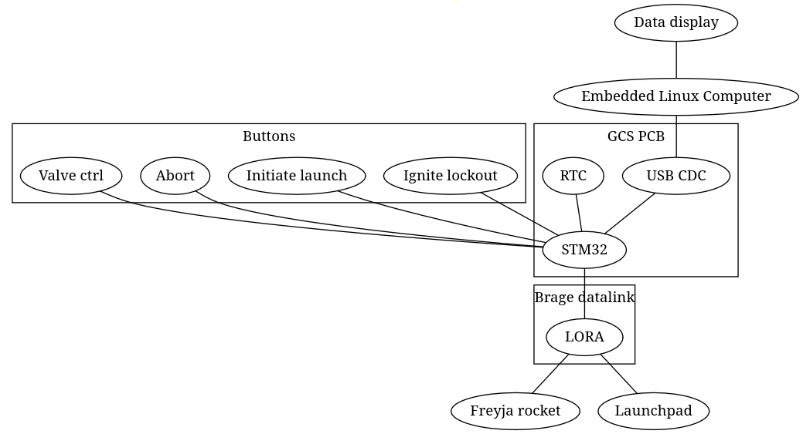

freyja ground control station. talks with launchpad controller surtr over lora through brage and to fjaelar over brage.

## goals
- pcb should be able to run standalone from raspberry in case of raspberry malfunction
- every part from lcsc so that pcb can be assembled by jlcpcb. only select parts that have lot in stock. 
- 4-layer pcb. mainly for usb signal integrity

## tools
kicad + the plugin [impartGUI](https://github.com/Steffen-W/Import-LIB-KiCad-Plugin). impartGUI makes it really easy to get symbols and footprints downloaded directly from lcsc.

## TODO PCB
- ESD/TVS diodes on every connecter and button
- Layout
- configure stackup according to jlcpcb specs
- usb 90 ohm diff-z
- valve toggle switches
- 10n cap on every switch for manual debounce, will do in software as well
- lockout switch or key
- initiate countdown button
- [x] 7-segment for redundancy operation without rpi
- abort countdown button
- leds:
  - HOT/READY led indicator
  - led for every valve toggle. should only be activated if surtr confirms position. 
  - connection status with surtr
  - connection status with fjaelar
  - alarm
- [x] battery charging circuit
  - [x] undervoltage lockout
- raspberry pi power
- 2 can ports
  - one for brage 
  - one for connecting directly to 
- buzzer? for alarms
- [x] short circuit protection
- [x] fan connector
- [x] battery ntc work up to 70deg
- [x] led backlight driver

## Components selection 
- 2 LiPo cells in series. (7.2V = 3.7 + 3.7V)
- Use DC-DC buck to step down the voltage to power RPi (min 4A continious current).
- We have to find a charging circuit for the 7.2V battries.
- Flip the toggle switch and hit send button to send command to sutur (this has to be done in the software).
- Therefore we will have 7 switches (6 toggle + 1 send)(in pull-up config).

### Part ID from LCSC
- C100042 - Capacitor
- C1788487 - Toggle switch
- C268254 - Push switch
- C965807 - Blue LED
- C965804 - Green LED
- C965799 - Red LED
- C95299 - Buzzer
- C42435361 - push button
- C18221474 - DC-DC booster
- C98220 - 10k ohm resistor

## To order
- [ ] 10-pin jst ph
- [ ] pcb

## SOFTWARE

We need two code bases. One Zephyr application that runs on the GCS PCB (PCB APP). And one Javascript and React + Python Raspberry Pi app (RPI APP) for displaying and managing the telemetry data. 

### PCB APP

Specs:
- Zephyr
- Talks with rocket and pad control through brage over CAN FD
- USB CDC to send data to RPI. Choose appropriate serialization format. 
- Sends valve toggle position only when send button has been pressed. 
- Shows status of valve on led.  

### RPI APP

Specs:
- Data to show:
  - Analog
    - With plot:
      - Altitude
      - Thrust. From loadcell. 
      - Orientation (from IMU)
      - Airbrake percantage
    - Without plot (only value):
      - Speed
      - Battery voltage
      - Countdown
      - Tank temperature. 6 ones spread over the tank.
      - Injector temperature
      - Post-combustion chamber temperature. 2 ones. 
      - Nozzle temperature. 2 ones.
      - Pressure at injector. 3 ones. 
    - Misc.
      - (GPS map if time over)
  - Discrete/bool:
    - Valve status (closed/open/unknown). 5 or 6 valves. 
    - Disarmed/armed
    - Ready/launched
    - Connection status with launch pad Surtr (down/up)
    - Connection status with rocket Fjalar (down/up)
    - Tank full float switch. (full/not full)
    - Main valve actuator (closed/open/unknown)
    - Abort valve actuator (closed/open/unknown)
    - CO2 activated [yes/no]
    - Parachute line cutters. 2 ones.
    - umbilical disconnect
    - tank bleed valve
- Gets binary data stream from GCS PCB. Hugo will help with protocol
  pack/unpack. [See wiki comparison of serialization formats](https://en.wikipedia.org/wiki/Comparison_of_data-serialization_formats). Maybe choose Protobuf or similar?
- Database to store all data

